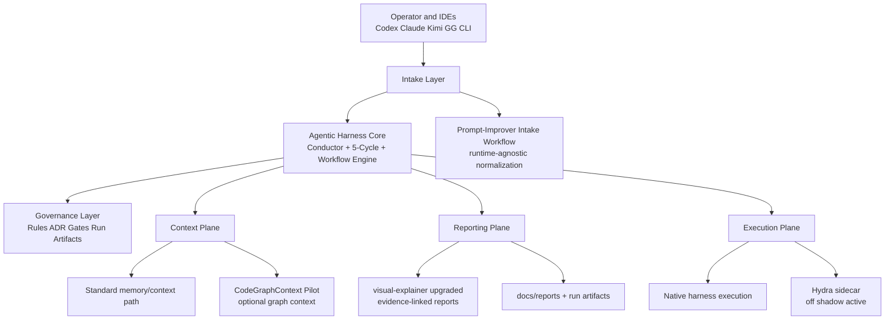

# Agentic Harness Priority Integration Architecture

Date: 2026-03-08  
Scope: prioritized wave only.

## Purpose

Define how the four prioritized external systems integrate into `gg-agentic-harness` while preserving deterministic gates, runtime parity, and governance contracts.

## Priority Target State

## Integration Mapping

| Repository | Harness Slot | Mode | Status |
| --- | --- | --- | --- |
| `CodeGraphContext/CodeGraphContext` | Context Plane | Optional pilot context source with fallback to standard memory path | Implemented (pilot) |
| `nicobailon/visual-explainer` | Reporting Plane | Upgraded `visual-explainer` adapter with evidence ingest and citations | Implemented |
| `severity1/claude-code-prompt-improver` | Intake Layer | Runtime-agnostic intake workflow wired into `go` and `paperclip-extracted` | Implemented |
| `Geargrindadmin/Hydra` | Execution Plane | Feature-flagged sidecar (`off|shadow|active`) with dual-research gate | Implemented |

## Addon Candidate (Separate Pilot Lane)

| Repository | Harness Slot | Mode | Status |
| --- | --- | --- | --- |
| `jovanSAPFIONEER/Network-AI` | Execution governance addon | Shadow-first optional sidecar pilot (`off|shadow|active`) | Assessment complete; pilot planned |

## Guardrails

1. Harness core remains source of truth for deterministic gates and final decisions.
2. Optional integrations must fail closed to standard harness behavior.
3. Sidecar routing cannot bypass quality gates or artifact traceability.
4. Every integration phase must run parity verification before rollout.
